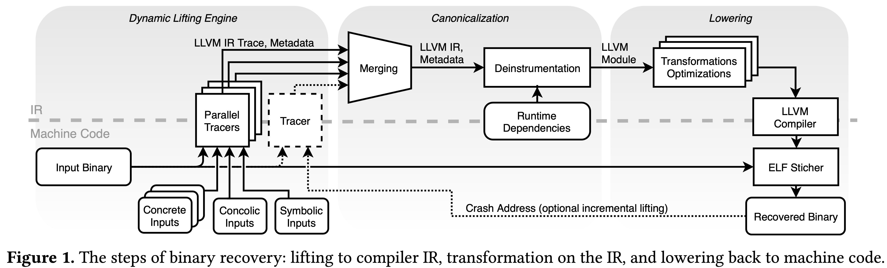

BinRec User Manual
==================

Welcome to BinRec's user manual! This document contains user-level information
on how to use BinRec to accomplish various binary recovery and recompilation
tasks.

System Overview
---------------

BinRec is a dynamic binary recovery / recompilation tool. At a high level,
it traces the execution of a target program with user provided inputs to record
the code necessary to process these inputs. The traces (one for each distinct
input) are then merged together and lifted to an intermediate program
representation that allows for transforming the recovered code. Finally,
the recovered code can then be recompiled back to a functioning binary.

Figure 1 below provides a more detailed overview of the tool. As shown,
the user provides BinRec with a target binary and one or more inputs
(e.g., command line invocations) to the binary. Arguments that make up these
inputs can be marked as symbolic (i.e., a wildcard) to trace all code
associated with that argument, regardless of its actual value. BinRec puts
the target binary into an emulated environment where it traces the execution
of the program on the provided inputs. Each trace consists of the executed code
in an intermediate representation and supplementary information about order in
which the recovered code was executed.

In the next stage of the pipeline, all collected traces (and their supplementary
info) are merged into a single representation.  This single program
representation is then refined to the point where it can be re-compiled back
into a functioning binary supporting the inputs provided during tracing.
Prior re-compilation, the refined code can be further transformed by the user
if needed (i.e., applying security hardening or performance optimization
transformations).



Installing BinRec
---------------

1. BinRec uses [just](https://github.com/casey/just#installation) to automate
various tasks including building BinRec. The first step in building BinRec is
to install this tool (and `curl` if not already installed). We provide a simple
shell script for this:

    ```bash
    ./get_just.sh
    ```

2. Next, BinRec and its dependencies can be fetched, built, and installed from
the root of this repository with:

    ```bash
    just install-binrec
    ```

3. (Optional) The above command will download a prebuilt QEMU virtual machine
image within which target binaries will run. The default prebuilt image is a
Linux `x86` image (currently the only supported environment). If you want to
download additional images (e.g., Linux `x64`) you can use the following
command:

   ```bash
   # just build-s2e-image <image_name>
   $ just build-s2e-image debian-9.2.1-x86_64
   ```

Walkthroughs of Common Workflows
--------------------------------

 1. [Debloating](walkthroughs/debloating.md)
 2. [Advanced Debloating](walkthroughs/advanced_debloating.md)
 3. [Advanced Tracing](walkthroughs/advanced_tracing.md)
 4. [General Guide to Binary Recovery](walkthroughs/generalguide.md)
 5. [Transforming Recovered Programs During Recompilation](walkthroughs/transformations.md)
 6. Using BinRec's Graphical Interface |TODO|

Known Limitations
-----------------

- Non-deterministic binaries may lift successfully but will not operate
exactly the same as the original binary because all code paths wouldn't
have been recorded during execution.
- All lifted floating point operations are done using 64-bit `double` values,
which may reduce the precision for some operations.

Appendix A: Some Useful BinRec Commands
--------------------------------------------------

- `just` (no command): List BinRec commands and a short description of
their behavior
- `just run-all-tests`: Runs BinRec's component- and system-level tests.
Useful if you suspect your installation has gone bad.
- `just describe <project>`: Prints all information about a given project.

Appendix B: BinRec Campaign File Format
--------------------------------------------------

The campaign file format can be found [here](./campaign_schema.md).
